# FRB Host Galaxy Pipeline (`pipeline_scripts/`)

End-to-end pipeline that takes a wide-field flux + inverse-variance FITS pair
and produces, for one FRB position:

1. a SExtractor source catalog and a PSFEx PSF model,
2. PS1 / Legacy Survey–anchored photometry plus an AstroPath host association,
3. non-parametric morphology (statmorph: CAS + Gini-M₂₀),
4. a GALFIT Sérsic decomposition of the most-probable host.

A single orchestrator (`master_run.py`) drives all five phases under a clean
`Output/` tree, exposing only the deliverables you ask for. The phase scripts
are designed to be runnable on their own as well, so any stage can be redone
without touching the others.

Every run also writes a **consolidated `pipeline_summary.json`** that merges
all per-phase JSON artefacts (zero points, field depth, sky QA, parsed GALFIT
host parameters + inclination, best AstroPath posterior) into a single,
human-readable file.

---

## New-host cohort tracking (46 FRBs)

| File | Purpose |
|------|---------|
| `new_hosts_master.csv` | One row per cohort FRB: cutout status, pipeline outcome, batch metadata, tags |
| `new_hosts_master.md` | Human-readable summary + embedded batch log when available |
| `large_cutouts/cutout_registry.csv` | All cutouts on disk (cohort + other FRBs) |

Refresh after downloads or pipeline runs: `python scripts/consolidate_new_hosts_logs.py`

---

## 1. Quick start

```powershell
# Full output (default)
python pipeline_scripts/master_run.py `
    --image  large_cutouts/20190608B_flux.fits `
    --invvar large_cutouts/20190608B_invvar.fits `
    --ra  334.02040578312 `
    --dec  -7.89886810526581 `
    --outputs all

# Condensed output (quick re-inspection: 1 JSON + 3 PNGs)
python pipeline_scripts/master_run.py `
    --image  large_cutouts/20190608B_flux.fits `
    --invvar large_cutouts/20190608B_invvar.fits `
    --ra  334.02040578312 `
    --dec  -7.89886810526581 `
    --condensed
```

Full output:
```
pipeline_scripts/Output/20190608B_all/
    pipeline_summary.json               # consolidated results (always written)
    image.cat, image.psf, proto_image.fits, segmentation_map.fits, ...
    calibrated_photometry_results.csv, zero_points.json (includes field_depth)
    astropath_association.png, astropath_posteriors.csv
    sep_vs_shape_r.png, sep_vs_x_max_reff.png
    fit.log, out.fits, galfit_results.png, qa_cutout_mask.png
    host_cutout.fits, host_mask.fits, host_sigma.fits, host_components.csv
    sky_fit_audit.json
```

Condensed output (`--condensed`):
```
pipeline_scripts/Output/20190608B_all/
    pipeline_summary.json
    galfit_results.png
    astropath_association.png
    qa_cutout_mask.png
```

RA/Dec for any FRB in the project lives in `master_frb_localization.csv`.

### Production `Output/` (62 hosts)

`pipeline_scripts/Output/<FRB>_all/` is reserved for the **62** FRBs listed in
`pipeline_galfit_results.csv` (each folder has a parseable `fit.log` from a
production host association). Do **not** leave experimental or low-confidence
runs in that tree — record them in
[`docs/EXCLUDED_RUNS.md`](docs/EXCLUDED_RUNS.md) instead.

Refresh the metrics table after batch changes:

```powershell
python scripts/compare_pipeline_galfit_vs_master.py
```

---

## 2. Prerequisites

| Component | Where it must work | Notes |
|---|---|---|
| Python ≥ 3.10 | Windows host | runs the orchestrators |
| WSL (Ubuntu) | linux side | `wsl source-extractor`, `wsl psfex`, `wsl galfit` must all run |
| Conda env `frb_project` | WSL side | activated by Phase 2 to host the AstroPath bridge |
| Python packages | both sides | `astropy`, `astroquery`, `pandas`, `pyyaml`, `matplotlib`, `scipy`, `numpy` |
| Python packages (optional) | Windows host | `statmorph`, `photutils` (Phase Statmorph; skipped gracefully if absent) |
| `astropath` package | repo (`tools/AstroPath/astropath_pkg/`) | path injected into the WSL script automatically |

**Reproducing the `frb_project` conda environment:**

```bash
# Create from the included spec file:
conda env create -f pipeline_scripts/environment_frb_project.yml

# Then install AstroPath from the repo submodule:
conda activate frb_project
cd tools/AstroPath/astropath_pkg && pip install -e .
```

The env bundles: `numpy`, `scipy`, `astropy`, `pandas`, `matplotlib`, `pyyaml`,
`astroquery`, `photutils`, `healpy`, `astropy-healpix`, `IPython`, `pyvo`
(for Legacy Survey TAP). See `pipeline_scripts/environment_frb_project.yml` for
pinned minimum versions.

Sanity check from PowerShell:

```powershell
wsl source-extractor -v
wsl psfex -v
wsl galfit
wsl -e bash -ic "conda activate frb_project && python -c 'import astropath; print(astropath.__file__)'"
```

---

## 3. `master_run.py` — orchestrator

Runs all five sub-phases (1 → 2 → 3a → statmorph → 3b); only the **collection
step** is selective. Before any phase runs, **input validation** checks RA/Dec
bounds (0 ≤ RA < 360, −90 ≤ Dec ≤ 90) and verifies the target falls within the
FITS WCS footprint (warning if outside). Use `--rerun-phase` to skip earlier
phases on an existing workdir, or `--dry-run` to preview commands without
executing.

### Required arguments
| Flag | Meaning |
|---|---|
| `--image PATH` | flux FITS |
| `--ra RA --dec DEC` | FRB localisation centre, ICRS degrees |

### Optional — run control
| Flag | Default | Meaning |
|---|---|---|
| `--invvar PATH` | none | inverse-variance FITS; enables weight-mapped SExtractor and a real GALFIT sigma map. `use_weight_map` automatically flips to `false` when this flag is omitted |
| `--outputs ...` | `all` | one or more of `catalog psf photometry astropath galfit statmorph all` |
| `--condensed` | off | emit only `pipeline_summary.json` + the three diagnostic PNGs (quick re-inspection without the full catalog / FITS weight) |
| `--frb-name STR` | derived from filename | overrides the output folder name |
| `--keep-workdir` | off | retains `<output>/.workdir/` for debugging |
| `--rerun-phase {1,2,3a,statmorph,3b}` | off | skip earlier phases; re-execute from this phase onward. Requires an existing workdir (`--keep-workdir` from a prior run) |
| `--dry-run` | off | print the commands that would be executed, then exit |
| `--use-localization-host` | off | Phase 3a centres on `--ra`/`--dec` (CSV host); ignores AstroPath host pick. Phase 2 still runs. |
| `--use-astropath-host` | off | Force AstroPath posteriors for Phase 3a (overrides `galfit_config.yaml` `cutouts.use_localization_host`) |

### Optional — YAML overrides
Anything passed on the command line wins; anything omitted keeps the YAML
default. The repo-level YAMLs are **never modified** — master_run writes a
per-run YAML into `<output>/.workdir/` and points the phases at that copy via
`--config`.

| Flag | Applies to | Default | Meaning |
|---|---|---|---|
| `--detect-thresh FLOAT` | Phase 1 + 2 | 3 | SExtractor `DETECT_THRESH` and `ANALYSIS_THRESH` (sigma) |
| `--deblend-mincont FLOAT` | Phase 1 + 2 | 0.005 | SExtractor `DEBLEND_MINCONT` (SExtractor/DES default; less arm/clump splitting than `1e-4`) |
| `--seeing-fwhm FLOAT` | Phase 1 + 2 | 2.0 | initial seeing FWHM (arcsec); Phase 2 re-measures from `proto_image.fits` |
| `--gain FLOAT` | Phase 1 + 2 | 1.6 | CCD gain (e⁻/ADU) |
| `--mag-mode {mag_aper,mag_psf,mag_auto}` | Phase 2 | `mag_aper` | calibrated magnitude fed to AstroPath (production aperture) |
| `--target-snr-min FLOAT` | Phase 2 | 0.0 | minimum `SNR_WIN` for AstroPath candidates |
| `--err-a-arcsec FLOAT` | Phase 2 | 1.0 | FRB localisation semi-major axis (arcsec) |
| `--err-b-arcsec FLOAT` | Phase 2 | 1.0 | FRB localisation semi-minor axis (arcsec) |
| `--err-theta-deg FLOAT` | Phase 2 | 0.0 | localisation PA (deg, E of N) |
| `--p-u FLOAT` | Phase 2 | 0.1 | prior probability that the true host is unseen |
| `--galfit-zp FLOAT` | Phase 3b | *(from Phase 2)* | override GALFIT `J)`; default is `zp_aper` from `zero_points.json` written into workdir `galfit_config.yaml` after Phase 2 |

Example:

```powershell
python pipeline_scripts/master_run.py `
    --image  large_cutouts/20180924B_flux.fits `
    --invvar large_cutouts/20180924B_invvar.fits `
    --ra 326.105235868384 --dec -40.9002526146074 `
    --err-a-arcsec 0.16 --err-b-arcsec 0.16 --err-theta-deg 0.0 `
    --p-u 0.05 `
    --outputs astropath photometry
```

### Tool keywords → exposed files
```
catalog    : image.cat
psf        : proto_image.fits, image.psf
photometry : calibrated_photometry_results.csv, zero_points.json
astropath  : astropath_association.png, astropath_posteriors.csv
statmorph  : statmorph_results.json
galfit     : fit.log, out.fits, galfit_results.png, qa_cutout_mask.png, sky_fit_audit.json
all        : every artefact in the workdir except staged inputs and SExtractor/PSFEx text templates
             (pipeline_summary.json is ALWAYS included in every mode)
```

### Layout
```
pipeline_scripts/Output/<frbname>_<tag>/
    pipeline_summary.json   # always present
    <files for the chosen tools>
    .workdir/        # only when --keep-workdir
```
`<tag>` is `all` for `--outputs all`, otherwise the sorted, underscore-joined
keywords (e.g. `photometry_galfit`).

---

## 4. The five phases

### Phase 1 — SExtractor + PSFEx
`SExtractor + PSFEx/run_psf_pipeline.py`

* Inputs: `image.fits` (+ optional `invvar.fits`).
* Runs SExtractor in dual-image mode, then PSFEx with iterative `SAMPLE_MINSN`
  retries (ladder `30, 20, 10, 5, 3, 2.5, 2`; stops as soon as ≥ `min_accepted_stars`
  stars are accepted — configurable in `pipeline_config.yaml`, default 25)
  so a PSF is still recovered on faint fields. Catalog name
  is hard-coded to `image.cat`.
* **Aperture ladder** is YAML-configurable (`sextractor.phot_apertures_px`,
  default 15 diameters from 4–40 px). The production aperture
  (`sextractor.production_aperture_px`, default null = largest) determines
  which `MAG_APER` column feeds Phase 2 calibration and Phase 3 GALFIT.
* **Template cleanup**: intermediate `default.{sex,param,conv,nnw,psfex}` files
  are removed after the run by default. Pass `--keep-templates` to retain them
  for manual inspection.
* Outputs: `image.cat`, `image.psf`, `proto_image.fits`, `psf_models.fits`,
  `psf_resi.fits`, `psfex_out.cat`, `psfex.xml`, `segmentation_map.fits`.
* Config: `SExtractor + PSFEx/pipeline_config.yaml` (`deblend_mincont: 0.005`, SExtractor/DES default).

### Phase 2 — Photometry + AstroPath
`photometry + astropath/run_photometry_astropath.py`

* Inputs: `image.fits`, `image.psf`, `proto_image.fits`, `image.cat`.
* Steps:
  1. **PSF re-photometry**: a second SExtractor pass with `PSF_NAME image.psf`
     produces `image.psf.cat`, the **single source of truth** for all
     downstream magnitudes (`MAG_APER`, `MAG_POINTSOURCE`, `MAG_AUTO`,
     `SPREAD_MODEL`, `FLAGS_MODEL`).
  2. **Zero-point calibration** queries **both** PS1 (Vizier `II/349`) and
     **Legacy Survey DR10 Tractor** (NOIRLab TAP `ls_dr10.tractor`), each
     wrapped in **retry logic** (3 attempts with exponential backoff: 2 s,
     4 s, 8 s). If a service is down after all retries, the pipeline degrades
     gracefully (continues with 0 matches from that catalog). Uses
     whichever yields more matched calibration stars (≥3; ties favour PS1).
     The catalog actually used is recorded
     in `zero_points.json` under `reference_catalog`. Three ZPs are
     reported: production aperture, PSF model, and Auto. **The ZP is now the
     sigma-clipped median** (not the mean), which is more robust to
     asymmetric reference-star outliers.
  3. **Candidate selection** within a configurable radius (default 60 ″ = 1 ′;
     set `astropath.search_radius_arcsec` in the YAML) around the FRB. Point-sources are
     rejected with an uncertainty-aware cut so faint galaxies (legit
     `SPREAD_MODEL > 0` but large `SPREADERR_MODEL`) survive:
     ```
     is_star  ⇔  SPREAD_MODEL + 3·SPREADERR_MODEL  <  0.005
     ```
     Candidates with calibrated magnitude outside `[12, 28]` or non-finite
     are also dropped — these are corrupt-flux artefacts (PSF flux ≤ 0)
     that otherwise blow up AstroPath's `driver_sigma` prior.
  4. **AstroPath association** through a WSL conda bridge. The integration
     grid step is set **adaptively** so the absolute step in arcsec stays
     `≤ σ_loc / 5` for every candidate (necessary because `px_Oi_local`
     scales the grid by candidate `φ`).
  5. WSL bridge errors are propagated: a Phase-2 failure exits 1 so
     `master_run.py` does not silently report Phase 2 as OK.
* Outputs: `calibrated_photometry_results.csv`, `zero_points.json` (includes
  **`field_depth`** block: 5σ `m_lim_5sigma_ab` at the production aperture),
  `astropath_posteriors.csv` (includes `sep_arcsec`),
  `astropath_association.png`, `sep_vs_shape_r.png`, `sep_vs_x_max_reff.png`,
  `image.psf.cat`.
* Config: `photometry + astropath/photometry_astropath_config.yaml` (`diagnostics`
  block: `geometry_plots`, `field_depth`; both default **on**).
* Helpers: `photometry + astropath/field_depth.py`,
  `photometry + astropath/pipeline_diagnostics.py` (shared with M49/R70 plot scripts).

#### AstroPath prior block
All prior knobs are now **YAML-configurable** under `astropath:` in
`photometry_astropath_config.yaml`.  Defaults reproduce the
**Aggarwal+2021 "adopted" prior set** as in
`astropath/priors.py::load_std_priors`.

| YAML key | Meaning | Default | Notes |
|---|---|---|---|
| `p_o_method` | candidate prior `P(O_i)` recipe | `"inverse"` | `"inverse"` · `"inverse_ang"` (÷R_eff) · `"inverse_ang2"` (÷R_eff²) · `"identical"` |
| `p_u` | unseen-host probability | `0.1` | set 0 to disable |
| `theta_pdf` | offset profile `P(θ\|O_i)` | `"exp"` | `"exp"` · `"uniform"` · `"core"` · `"flat"` |
| `theta_max` | truncation radius in units of φ | `6.0` | matches Aggarwal+2021 |
| `theta_scale` | exp e-folding multiplier | `1.0` | only used by `"exp"` |
| `search_radius_arcsec` | candidate search box + P(U) normalisation | `60.0` | propagates to PNG zoom + magnitude selection |
| — | numerical integration grid | `"local"` | hardwired; `"fixed"` available in AstroPath directly |
| — | grid step in units of φ | adaptive | `≤ σ_loc / (5 · φ_max)`, floor 0.005, cap 0.1 |

### Phase 3a — GALFIT cutouts
`galfit_fitting/generate_galfit_cutouts.py`

* Inputs: `image.fits` (+ `invvar.fits`), `segmentation_map.fits`,
  `image.cat`, FRB RA/Dec.
* **Target selection (AstroPath override)**: By default Phase 3a looks for
  `astropath_posteriors.csv` and centres on the highest `posterior_O` host if it
  clears `min_astropath_posterior` (default `0.05` in
  `galfit_config.yaml` → `cutouts:`). Set `cutouts.use_localization_host: true`
  or pass `master_run.py --use-localization-host` to always use `--ra`/`--dec`
  (the secure host position from `master_frb_localization.csv` for
  `coord_semantics=host` rows). AstroPath still runs in Phase 2 for cross-check.

  Config (`galfit_config.yaml`):
  ```yaml
  cutouts:
    use_localization_host: true   # repo default: secure CSV host is preferred
    min_astropath_posterior: 0.05
    no_data_sigma: 1.0e30         # sigma for invvar<=0 pixels
    sigma_rescale_min: 0.5        # rescale gate lower bound
    sigma_rescale_max: 2.0        # rescale gate upper bound
    psf_match_arcsec: 0.5         # sky-match tolerance for SPREAD lookup
  ```

  CLI flags (direct Phase 3a or via `master_run`):
  ```
  --astropath-posteriors PATH
  --min-astropath-posterior FLOAT
  --no-astropath-override           # localization host (--ra/--dec)
  --use-localization-host           # master_run only
  --mag-aper-index INT              # production aperture column (master_run sets automatically)
  --psf-match-arcsec FLOAT
  --no-data-sigma FLOAT
  --sigma-rescale-min FLOAT
  --sigma-rescale-max FLOAT
  ```
* **Host must be a galaxy (SPREAD cut).** Phase 2 writes `sex_number`
  (SExtractor `NUMBER` in **`image.psf.cat`**) into `astropath_posteriors.csv`.
  When AstroPath mode is active, Phase 3a re-checks SPREAD on that Phase-2 ID,
  then **maps to Phase 1 `image.cat` / segmentation `NUMBER` by sky position**
  (the two passes can assign different IDs to the same galaxy). With
  `--use-localization-host`, Phase 3a walks
  sources by separation from the CSV position and picks the nearest galaxy
  passing `SPREAD_MODEL + 3·SPREADERR_MODEL ≥ 0.005` within
  `--max-host-sep-arcsec`; the run aborts if none qualify — FRBs are never
  associated to stars.
* **Neighbor handling — by containment, not radius.** Starting from
  `ROI = host_seg_bbox + --host-pad` (default 20 px), every other seg
  island that touches the ROI is categorised by
  `frac = pixels_in_ROI / total_pixels`:

  | frac vs thresholds | category | action |
  |---|---|---|
  | `frac ≥ --contain-thresh` (default `0.95`) | **fully contained** | fit as a Sérsic *(or mask if `CLASS_STAR ≥ --neighbor-class-star-max`)* |
  | `--expand-thresh ≤ frac < --contain-thresh` (default `0.50`) | **largely filled** | grow the ROI to include the source's pixels, then fit (or mask if stellar) |
  | `0 < frac < --expand-thresh` | **fringe** | mask the in-frame pixels only; ROI does **not** grow |
  | `frac == 0` | **out of frame** | ignored |

  The expand-and-recategorise loop iterates up to `--max-roi-iterations`
  (default 6). Sources are never picked up just because they are nearby in
  pixel space — they must actually project into the ROI. The FRB host is
  **always** added to the fit set first and never masked, even if
  `CLASS_STAR` would otherwise classify it stellar.
* Outputs:
  * `host_cutout.fits` — flux stamp.
  * `host_sigma.fits` — `1 / sqrt(invvar)` with `invvar ≤ 0` or non-finite
    pixels mapped to `σ = no_data_sigma` (configurable, default 1e30). The
    absolute scale is sanity-checked against the empirical sky noise
    (robust MAD × 1.4826 over unmasked pixels): if the invvar-derived sigma
    disagrees with the sky scatter by more than the configurable gate
    `[sigma_rescale_min, sigma_rescale_max]` (default `[0.5, 2.0]`), the
    cutout sigma is multiplied by a single global factor
    `k = σ_sky / σ_invvar`. This preserves the spatial structure of the
    invvar map while pinning its absolute scale to the data. `k` is logged
    per FRB.
  * `host_mask.fits` — bad-pixel mask (1 = excluded); also flags `invvar ≤ 0` pixels.
  * `host_components.csv` — initial Sérsic parameters from SExtractor.
    Rows are ordered with the **FRB host first**, then neighbor
    components, so GALFIT's component 1 is always the host.
  * `qa_cutout_mask.png` — visual QA of the cutout + mask.

### Phase Statmorph — non-parametric morphology (new)
`galfit_fitting/run_statmorph_pipeline.py`

* Runs **after** Phase 3a (cutout generation) and **before** Phase 3b (GALFIT).
* Uses `statmorph` to compute CAS (Concentration, Asymmetry, Smoothness),
  Gini, M₂₀, Petrosian/half-light radii, and Gini-M₂₀ merger/bulge statistics.
* Inputs: `host_cutout.fits`, `host_sigma.fits` (optional), `proto_image.fits` (PSF, optional).
* Output: `statmorph_results.json` — folded into `pipeline_summary.json`.
* **Future note:** Statmorph metrics (e.g. high asymmetry, merger flag) can
  motivate GALFIT initial conditions or flag fits for manual review. This
  integration point is intentionally placed before GALFIT for this reason.
* Best-effort: if `statmorph` is not installed, this phase is silently skipped.

### Phase 3b — GALFIT fit
`galfit_fitting/run_galfit_fitting.py`

* Inputs: outputs of 3a + `proto_image.fits` for PSF convolution + workdir
  `galfit_config.yaml` (written by `master_run.py` after Phase 2).
* **Hard abort** if `proto_image.fits` is missing (exit 1).
* **Photometric ZP:** `mag_zeropoint` resolved as workdir `galfit_config.yaml`
  → `zero_points.json` **`zp_aper`** (production aperture calibration from
  Phase 2) → fallback 22.5. `master_run.py` sets this automatically after
  Phase 2; override with `--galfit-zp` on the orchestrator CLI.
* **Initial magnitude:** guards against NaN / SExtractor's 99.0 sentinel via
  cascade fallback `MAG_40PX → MAG_AUTO → midpoint(mag_min, mag_max)`, then
  clamps into `[mag_min, mag_max]`.
* **PA convention:** `pa = THETA_IMAGE − 90°` (SExtractor +x → GALFIT +y).
* **Per-component constraints:** `n ∈ [0.5, 6.0]`, `re ∈ [1.5, 100.0]`,
  **`mag ∈ [8, 40]`** (wide AB band at `J)`; tunable via `mag_min` / `mag_max` in
  `galfit_config.yaml`). Written to `constraints.txt` for every Sérsic.
* **Convolution box:** GALFIT `I)` = `(xmax + conv_box_pad, ymax + conv_box_pad)`;
  `conv_box_pad` is configurable (default 24 px) in `galfit_config.yaml`.
* **Sky QA (two-pass):**
  1. Seed global sky from SExtractor `BACKGROUND` on host row 0 in
     `host_components.csv` (ADU).
  2. Run GALFIT (pass 1, sky free). **Crash detection:** if WSL output contains
     `GALFIT crashed` / `Singular Matrix`, or `fit.log` is empty, pass 1 is marked
     failed — **no** pass-2 retry (retries are only for parsed sky drift, not crashes).
  3. Parse fitted sky from the last **sane** `fit.log` block (`Chi^2/nu < 10⁶`);
     reject unphysical levels (e.g. blow-ups to ±10⁴ ADU when the seed is ~10⁻⁴).
  4. If `|sky_fit − sky_ref| > sky_tolerance_adu` (default **3 ADU**), clear
     artifacts and rerun with `{sky_comp} 1 −tol tol` in `constraints.txt` (pass 2).
  5. Write `sky_fit_audit.json` (`sky_ref_adu`, `sky_pass1_adu`, `sky_pass2_adu`,
     `galfit_pass1_ok`, `galfit_pass2_ok`, `failure_reason`, `passed`).
     Exit **1** if GALFIT crashes, sky cannot be parsed, or QA still fails after
     `sky_max_retries` (default 1).
* Outputs: `galfit.feedme`, `constraints.txt`, `galfit.01`, `fit.log`,
  `out.fits` (data | model | residual), `galfit_results.png`,
  `sky_fit_audit.json`.

**Phase 3b only (no Phases 1–2):**

```powershell
python scripts/rerun_pipeline_galfit_phase3b.py --frb 20190608B
# or: python pipeline_scripts/galfit_fitting/run_galfit_fitting.py --dir pipeline_scripts/Output/20190608B_all
```

---

## 5. Consolidated output — `pipeline_summary.json`

Every run writes `pipeline_summary.json` into the output folder regardless of
`--outputs` or `--condensed`. The file merges all per-phase machine-readable
artefacts into a single, well-formatted JSON:

```json
{
  "frb": "20190608B",
  "ra_deg": 334.02040578312,
  "dec_deg": -7.89886810526581,
  "plate_scale_arcsec_px": 0.262,
  "timestamp_utc": "2025-06-16T18:30:00+00:00",
  "phase_exit_codes": {
    "phase1_sextractor_psfex": 0,
    "phase2_photometry_astropath": 0,
    "phase3a_galfit_cutouts": 0,
    "phase_statmorph": 0,
    "phase3b_galfit_fit": 0
  },
  "psf_quality": {
    "FWHM_FromFluxRadius_Mean": 2.34,
    "FWHM_FromFluxRadius_StDev": 0.12,
    "Ellipticity_Mean": 0.04,
    "NStars_Accepted_Total": 42,
    "Chi2_Mean": 1.02
  },
  "photometry": {
    "reference_catalog": "PS1",
    "n_calibration_stars": 42,
    "zp_aper": 25.1234,
    "zp_aper_std": 0.045,
    "zp_psf": 25.0987,
    "zp_psf_std": 0.052,
    "zp_auto": 25.1102,
    "zp_auto_std": 0.048,
    "production_aperture_px": 40.0,
    "filter_band": "r"
  },
  "field_depth": {
    "m_lim_5sigma_ab": 24.3,
    "sigma_sky_adu_per_pix": 0.0012,
    "seeing_fwhm_arcsec": 1.23
  },
  "astropath": {
    "ra_deg": 334.0204,
    "dec_deg": -7.8989,
    "posterior_O": 0.987,
    "posterior_U": 0.013,
    "sep_arcsec": 0.15
  },
  "sky_qa": {
    "sky_ref_adu": 0.00012,
    "sky_final_adu": 0.00015,
    "passed": true,
    "retried": false
  },
  "statmorph": {
    "gini": 0.512,
    "m20": -1.73,
    "concentration": 3.12,
    "asymmetry": 0.045,
    "smoothness": 0.012,
    "rpetro_circ_px": 12.3,
    "r20_px": 3.8,
    "r80_px": 9.1,
    "sn_per_pixel": 5.4,
    "gini_m20_merger": -0.23,
    "gini_m20_bulge": 0.67,
    "flag": 0,
    "flag_sersic": 0
  },
  "galfit_host": {
    "chi2nu": 1.234,
    "mag": 21.45,
    "mag_err": 0.05,
    "re_px": 5.67,
    "re_px_err": 0.34,
    "re_arcsec": 1.486,
    "re_arcsec_err": 0.089,
    "n": 1.23,
    "n_err": 0.08,
    "b_a": 0.456,
    "b_a_err": 0.025,
    "pa_deg": 34.5,
    "pa_deg_err": 2.1,
    "inclination_deg": 67.8,
    "inclination_deg_err": 2.1,
    "inclination_mc": {
      "median_deg": 67.5,
      "err_lo_deg": 1.8,
      "err_hi_deg": 2.6,
      "p16_deg": 65.7,
      "p84_deg": 70.1
    },
    "n_sersic_components": 2
  }
}
```

**New / changed in this version:**
- `plate_scale_arcsec_px`: derived from the FITS WCS header (never hardcoded).
- `psf_quality`: PSF FWHM, ellipticity, residuals, star counts from PSFEx XML.
- `statmorph`: non-parametric morphology (CAS, Gini-M₂₀) from statmorph.
- `galfit_host.re_arcsec` / `re_arcsec_err`: effective radius in arcseconds.
- `galfit_host.inclination_mc`: Monte Carlo inclination with asymmetric 16th/84th
  percentile CIs (more robust near edge-on where analytic propagation breaks down).
- All GALFIT parameters include `_err` counterparts.
- `photometry.zp_aper`: renamed from `zp_aper_40px` (matches any production aperture).
- Pixel scale is now computed from the WCS per-image; removed from YAML configs.
- AstroPath priors (`p_o_method`, `theta_pdf`, `search_radius_arcsec`) are YAML-configurable.
- Candidate prior options: `inverse`, `inverse_ang` (÷R_eff), `inverse_ang2` (÷R_eff²), `identical`.
- Offset profile options: `exp`, `uniform`, `core`, `flat`.

The per-phase JSONs (`zero_points.json`, `sky_fit_audit.json`) are still
written individually for backward compatibility with scripts that read them
directly. `pipeline_summary.json` is the recommended machine-readable entry
point for new analysis code.

---

## 6. Pipeline logic flowchart

High-level data flow and **decision gates** (checks that can branch, retry,
or abort). For a single FRB, `master_run.py` always runs
Phases 1 → 2 → 3a → statmorph → 3b when prerequisites succeed; only the
**file collection** step is selective (`--outputs`).

```mermaid
flowchart TB
  subgraph INPUTS["Inputs"]
    FLUX["large_cutouts/FRB_flux.fits"]
    INV["large_cutouts/FRB_invvar.fits optional"]
    LOC["master_frb_localization.csv RA Dec ellipse"]
  end

  subgraph MASTER["master_run.py"]
    STAGE["Stage image.fits + invvar.fits into .workdir"]
    YAML["Write pipeline_config.yaml + photometry_astropath_config.yaml"]
    STAGE --> YAML
  end

  subgraph P1["Phase 1 — SExtractor + PSFEx"]
    P1A["SExtractor dual-image detection"]
    P1B{"invvar provided?"}
    P1C["Weight map ON in SExtractor"]
    P1D["Weight map OFF"]
    P1E["PSFEx SAMPLE_MINSN=30"]
    P1F{"PSF stars OK?"}
    P1G["Retry SAMPLE_MINSN=10"]
    P1H["image.cat proto_image.fits segmentation_map"]
    P1A --> P1B
    P1B -->|yes| P1C
    P1B -->|no| P1D
    P1C --> P1E
    P1D --> P1E
    P1E --> P1F
    P1F -->|no| P1G --> P1E
    P1F -->|yes| P1H
  end

  subgraph P2["Phase 2 — Photometry + AstroPath"]
    P2A["SExtractor + PSF_NAME → image.psf.cat"]
    P2B["Measure seeing FWHM from proto_image.fits"]
    P2C["Query PS1 + Legacy; pick more matches ≥3"]
    P2D["ZP from PS1 II/349"]
    P2E["ZP from Legacy LS DR10 TAP"]
    P2F["zero_points.json zp_aper zp_psf zp_auto"]
    P2G["1 arcmin box: galaxy candidates"]
    P2H{"SPREAD + 3σSPREADERR < 0.005?"}
    P2I["Reject point sources"]
    P2J{"mag in 12–28?"}
    P2K["Drop corrupt flux"]
    P2L["AstroPath WSL grid step ≤ σ_loc/5"]
    P2M["astropath_posteriors.csv P_O P_U"]
    P2A --> P2B --> P2C
    P2C --> P2D
    P2C --> P2E
    P2D --> P2F
    P2E --> P2F
    P2F --> P2G --> P2H
    P2H -->|star| P2I
    P2H -->|galaxy| P2J
    P2J -->|no| P2K
    P2J -->|yes| P2L --> P2M
  end

  subgraph BRIDGE["Between Phase 2 and 3"]
    GCFG["write_galfit_config.yaml mag_zeropoint=zp_aper"]
    SUMMARY["build pipeline_summary.json incl. PSF metrics, re_arcsec, MC inclination, statmorph"]
  end

  subgraph P3A["Phase 3a — Cutouts"]
    P3A0{"astropath_posteriors.csv?"}
    P3A1["Centre on max posterior_O ≥ 0.05"]
    P3A2["Centre on CLI RA Dec"]
    P3A3["ROI = host seg bbox + pad"]
    P3A4["For each neighbor seg in ROI"]
    P3A5{"frac in ROI"}
    P3A6["frac≥0.95 → fit Sérsic"]
    P3A7["0.5≤frac<0.95 → expand ROI"]
    P3A8["0<frac<0.5 → mask pixels"]
    P3A9{"CLASS_STAR ≥ 0.9?"}
    P3A10["Mask neighbor not fit"]
    P3A11["host_components.csv host row 0 first"]
    P3A12{"σ_invvar vs sky MAD"}
    P3A13["Rescale host_sigma × k if outside gate"]
    P3A14["host_cutout host_mask host_sigma qa_cutout_mask"]
    P3A1a["Use posteriors sex_number + SPREAD check"]
    P3A2a["Nearest galaxy to RA Dec within 5 arcsec"]
    P3A0 -->|yes| P3A1 --> P3A1a --> P3A3
    P3A0 -->|no| P3A2 --> P3A2a --> P3A3
    P3A3 --> P3A4 --> P3A5
    P3A5 --> P3A6
    P3A5 --> P3A7
    P3A5 --> P3A8
    P3A6 --> P3A9
    P3A7 --> P3A9
    P3A9 -->|stellar| P3A10
    P3A9 -->|galaxy| P3A11
    P3A11 --> P3A12 --> P3A13 --> P3A14
  end

  subgraph P3B["Phase 3b — GALFIT"]
    P3B0{"proto_image.fits exists?"}
    P3B1["ABORT exit 1"]
    P3B2["Build feedme + constraints n,re,mag"]
    P3B3["Pass 1: wsl galfit sky free"]
    P3B3A{"GALFIT OK + sky parsed?"}
    P3B4{"|sky_fit − BACKGROUND| ≤ 3 ADU?"}
    P3B5["Pass 2: sky constrained ±3 ADU"]
    P3B6{"Sky QA passed?"}
    P3B7["exit 1 + sky_fit_audit.json"]
    P3B8["fit.log out.fits galfit_results.png"]
    P3B0 -->|no| P3B1
    P3B0 -->|yes| P3B2 --> P3B3 --> P3B3A
    P3B3A -->|no| P3B7
    P3B3A -->|yes| P3B4
    P3B4 -->|yes| P3B8
    P3B4 -->|no| P3B5 --> P3B6
    P3B6 -->|yes| P3B8
    P3B6 -->|no| P3B7
  end

  subgraph OUT["Deliverables"]
    COLL["Collect per --outputs / --condensed → Output/FRB_tag/"]
  end

  FLUX --> STAGE
  INV --> STAGE
  LOC --> MASTER
  YAML --> P1A
  P1H --> P2A
  P2M --> GCFG
  GCFG --> P3A0
  subgraph SM["Phase Statmorph"]
    SM1["statmorph CAS + Gini-M20 on host_cutout"]
    SM2["statmorph_results.json"]
    SM1 --> SM2
  end

  P3A14 --> SM1
  SM2 --> P3B0
  P3B8 --> SUMMARY --> COLL
```



**How the pieces connect**

| Step | Feeds forward |
|------|----------------|
| Phase 1 `image.cat` + `segmentation_map` | Phase 2 re-photometry; Phase 3a cutout geometry |
| Phase 1 `proto_image.fits` | Phase 2 seeing; **required** Phase 3b PSF convolution |
| Phase 2 `zero_points.json` | Phase 3b `mag_zeropoint` via `galfit_config.yaml` |
| Phase 2 `astropath_posteriors.csv` | Phase 3a target = same host as association |
| Phase 3a `host_components.csv` | Phase 3b Sérsic seeds + sky `BACKGROUND` reference |
| Phase 3a `host_sigma.fits` | Phase 3b χ² weighting (optional if absent); Statmorph weightmap |
| Phase 3a `host_cutout.fits` | Statmorph input; Phase 3b GALFIT data |
| Phase 1 `proto_image.fits` | Statmorph PSF (optional); Phase 3b PSF convolution |
| Statmorph `statmorph_results.json` | Folded into `pipeline_summary.json`; future: inform GALFIT config |
| All phases | `pipeline_summary.json` (consolidated by `master_run.py` after Phase 3b) |

**Failure / skip behaviour**

| Gate | On failure |
|------|------------|
| Phase 1 | `master_run` **stops** (hard dependency) |
| Phase 2 | logged non-zero; collection may still run partial outputs |
| Phase 3a | skipped if Phase 2 failed badly; needs catalog + segmap |
| Statmorph | best-effort: skipped if `statmorph` not installed or cutout missing; does **not** block Phase 3b |
| Phase 3b | skipped if no `host_cutout.fits`; **exit 1** if proto missing, GALFIT crashes, or sky QA fails |
| Input validation | RA/Dec out of bounds → hard abort; WCS pixel outside footprint → warning only |
| `run_all_frbs.py` | skips FRBs with `coord_semantics != host` unless `--include-signal` |

ASCII summary (same logic, no Mermaid renderer needed):

```
[flux.fits + invvar?] → master_run stages .workdir
    → validate RA/Dec bounds + WCS containment
    → Phase 1: SExtractor → PSFEx (retry MINSN) → cat, PSF, segmap
    → Phase 2: PSF cat → PS1|Legacy ZP (retry-wrapped) → star/galaxy cut → AstroPath
    → write galfit_config (zp_aper)
    → Phase 3a: AstroPath host → containment ROI loop → σ scale check → cutouts
    → Statmorph: CAS + Gini-M₂₀ on host cutout (best-effort)
    → Phase 3b: proto check → GALFIT (NaN-safe seed) → sky QA [retry?] → fit.log
    → build pipeline_summary.json (incl. re_arcsec, MC inclination, PSF metrics, statmorph)
    → collect → Output/<FRB>_<tag>/
```

---

## 7. Configuration files

| File | Phase | Notable keys |
|---|---|---|
| `SExtractor + PSFEx/pipeline_config.yaml` | 1 | `sextractor.{detect_thresh, deblend_mincont, gain, seeing_fwhm, use_weight_map, phot_apertures_px, production_aperture_px}`, `psfex.{psf_sampling, sample_minsn, sample_max_ellp, min_accepted_stars}` |
| `photometry + astropath/photometry_astropath_config.yaml` | 2 | `sextractor_psf.*` (mirrors phase-1, plus `mag_mode`, `phot_apertures_px`, `production_aperture_px`), `astropath.{err_a_arcsec, err_b_arcsec, err_theta_deg, p_u, p_o_method, theta_pdf, theta_max, theta_scale, search_radius_arcsec, target_snr_min, filter_band}` |
| `galfit_fitting/galfit_config.yaml` | 3a+3b | `cutouts.{use_localization_host, min_astropath_posterior, no_data_sigma, sigma_rescale_min, sigma_rescale_max, psf_match_arcsec}`, `mag_min`/`mag_max` (8–40), `conv_box_pad` (24), `sky_check_enabled`, `sky_tolerance_adu`, `sky_max_retries` |
| `environment_frb_project.yml` | — | Conda env spec for `frb_project` (WSL side) |

Each `master_run.py` invocation gets its own copy in `<output>/.workdir/`
with CLI overrides applied; the repo YAMLs change defaults for all future
runs that don't pass the matching CLI flag.

`pixel_scale` is no longer set in any YAML — it is computed from the
FITS WCS header at runtime by `master_run.py` (via
`astropy.wcs.utils.proj_plane_pixel_scales`) and injected into the
workdir config copies.  Phase scripts also compute it directly as a
fallback when run standalone.

`use_weight_map` defaults to `true`. master_run writes
`use_weight_map: <invvar_provided>` into the workdir copy, so this key only
needs touching when running a phase script directly without the master.

The AstroPath statistical priors (P(O), P(θ), P(U)) are now fully
YAML-configurable under `astropath:` (see the prior block table above).

---

## 8. Shared infrastructure — `pipeline_shared.py`

A new module `pipeline_scripts/pipeline_shared.py` centralises code that was
previously duplicated across phase scripts:

| Export | Purpose |
|--------|---------|
| `TEMPLATE_CONV` / `TEMPLATE_NNW` | SExtractor static template strings |
| `DEFAULT_APERTURE_DIAMS_PX` | Canonical 15-element aperture ladder |
| `resolve_apertures(sex_cfg)` | YAML → `(aperture_list, prod_index, prod_diam)` |
| `format_phot_apertures(list)` | Render for SExtractor `PHOT_APERTURES` |
| `render_param_template(tmpl, n)` | Substitute `{NAPER}` in `.param` templates |
| `get_logger(name)` | Shared `logging` factory with unified format |

All phase scripts import from this module. Logging uses a consistent format:
```
[HH:MM:SS] LEVEL frb_pipeline.<phase> | message
```

---

## 9. Output glossary

| File | Phase | Description |
|---|---|---|
| `pipeline_summary.json` | master | **Consolidated** results: photometry, field depth, AstroPath, sky QA, GALFIT host (incl. inclination) |
| `image.cat` | 1 | LDAC FITS source catalog |
| `image.psf` | 1 | PSFEx PSF model |
| `proto_image.fits` | 1 | 25 × 25 PSF stamp used by GALFIT |
| `segmentation_map.fits` | 1 | per-source pixel labels |
| `psf_models.fits`, `psf_resi.fits`, `psfex_out.cat`, `psfex.xml` | 1 | PSFEx diagnostics |
| `image.psf.cat` | 2 | re-photometry catalog (PSF-corrected) |
| `image.homo.fits` | 2 | homogeneity map |
| `calibrated_photometry_results.csv` | 2 | per-source RA/Dec, three calibrated mags, FLUX_RADIUS, SPREAD_MODEL, AstroPath inclusion flag |
| `zero_points.json` | 2 | the three ZPs + N_stars + `n_ps1_matches` / `n_legacy_matches` + reference catalog id |
| `astropath_posteriors.csv` | 2 | candidate-level RA/Dec/mag/ang_size/`sex_number`/posterior_O/posterior_U |
| `astropath_association.png` | 2 | host overlay + posterior-vs-magnitude scatter (stretch computed on the 1 ′ zoom region) |
| `host_cutout.fits`, `host_sigma.fits`, `host_mask.fits` | 3a | GALFIT inputs |
| `host_components.csv` | 3a | initial Sérsic parameters; host = row 0 |
| `qa_cutout_mask.png` | 3a | visual QA of the cutout + mask |
| `statmorph_results.json` | statmorph | CAS, Gini, M₂₀, Petrosian radii, merger/bulge statistics, flags |
| `galfit.feedme`, `constraints.txt`, `galfit.01` | 3b | GALFIT inputs and last iteration |
| `fit.log` | 3b | parameters + 1σ errors |
| `out.fits` | 3b | three-extension data block: data \| model \| residual |
| `galfit_results.png` | 3b | three-panel diagnostic |
| `sky_fit_audit.json` | 3b | sky QA (`sky_*`, `passed`, `galfit_pass*_ok`) plus GALFIT host `host_number`, `snr_win` (SExtractor WIN), optional `snr_auto` (`FLUX_AUTO`/`FLUXERR_AUTO`), `mag_40px_inst` from `host_components.csv` row 0 |

---

## 10. Photometric reference co-check (PS1 vs Legacy)

Phase 2 always queries **Pan-STARRS1** (Vizier `II/349`, `rmag < 20`,
`Nd > 6`) and **Legacy Survey DR10 Tractor** (NOIRLab TAP `ls_dr10.tractor`:
`type='PSF'`, `fracflux_r < 0.05`, `anymask_r = 0`, `flux_r` converted to
`rmag = 22.5 − 2.5 log₁₀(flux_r)` with `rmag < 20`). **Nanomaggies are never
used as reported magnitudes** — only converted to AB for the reference-star
offset. The ZP is `median(ref_AB − MAG_APER_inst)` on `image.psf.cat` with
`MAG_ZEROPOINT=0`; calibrated mags and GALFIT `J)` are in **AB**. Both surveys use the
full FITS footprint (WCS pixel scale × `NAXIS1`/`NAXIS2`, typically
~10′ × 10′ for standard cutouts). After matching clean PSF stars at
0.6 ″, the survey with **more** matches is used if it has ≥ 3 stars; ties
favour PS1. `zero_points.json` records `n_ps1_matches`, `n_legacy_matches`,
and `reference_catalog`. Requires `pyvo` in the WSL `frb_project` env for
Legacy; if `pyvo` is missing, only PS1 is attempted.

---

## 11. Re-running individual phases

**Preferred method — `--rerun-phase`:** If a prior run used `--keep-workdir`,
you can skip earlier phases:

```powershell
# Re-run only Phase 3b (GALFIT) on an existing workdir:
python pipeline_scripts/master_run.py `
    --image large_cutouts/20190608B_flux.fits `
    --invvar large_cutouts/20190608B_invvar.fits `
    --ra 334.02040578312 --dec -7.89886810526581 `
    --rerun-phase 3b --keep-workdir

# Re-run from Statmorph onward:
python pipeline_scripts/master_run.py ... --rerun-phase statmorph --keep-workdir
```

**Manual method —** the phase scripts are also independently runnable. Example,
re-fitting GALFIT only on a workdir that already contains the cutouts:

```powershell
python "pipeline_scripts/galfit_fitting/run_galfit_fitting.py" `
    --dir "pipeline_scripts/Output/20190608B_all/.workdir"
```

For Phase 2 from a workdir that already has the catalog and PSF (working
directory must be the workdir; canonical names are required):

```powershell
python "pipeline_scripts/photometry + astropath/run_photometry_astropath.py" `
    --image image.fits `
    --ra 334.02040578312 --dec -7.89886810526581
```

---

## 12. Batch driver — `run_all_frbs.py`

```powershell
python pipeline_scripts/run_all_frbs.py
```

* Reads `master_frb_localization.csv` and runs `master_run.py` for every
  FRB with `<FRB>_flux.fits` (+ optional `_invvar.fits`) in `large_cutouts/`.
* Pulls `major_sigma_as`, `minor_sigma_as`, `pa_deg` for the error ellipse;
  falls back to a 1 ″ × 1 ″ circle otherwise.
* By default, only runs FRBs whose `coord_semantics` is `host`.
* Captures each run's full stdout to `<output>/master_run.log` and writes
  a per-FRB summary table at the end of the batch.
* **Progress ETA:** In sequential mode, displays an EMA-smoothed time-remaining
  estimate after each FRB completes.
* **HTML report:** After the batch, writes `Output/batch_report.html` with a
  summary table, embedded PNG thumbnails, and links to each `pipeline_summary.json`.
* **Auto-refresh:** Automatically runs `scripts/compare_pipeline_galfit_vs_master.py`
  after the batch to update `pipeline_galfit_results.csv` (suppress with
  `--no-auto-refresh`).

Useful flags:

| Flag | Meaning |
|---|---|
| `--frb FRB [FRB …]` | restrict to a specific subset |
| `--skip-existing` | skip FRBs whose output folder already contains the target deliverables |
| `--outputs ...` | forwarded to `master_run.py` (default `all`) |
| `--condensed` | forwarded to `master_run.py` (JSON + 3 PNGs only) |
| `--include-signal` | also run rows where `coord_semantics != host` |
| `--use-localization-host` | Phase 3a uses CSV host coords; AstroPath still runs in Phase 2 |
| `--list-file PATH` | `.txt` (one FRB/line) or `.csv` with `frb` column (`new_hosts_master.csv`) |
| `--keep-workdir` | forward `--keep-workdir` to `master_run.py` |
| `--rerun-phase {1,2,3a,statmorph,3b}` | forwarded to `master_run.py`; re-execute from this phase onward |
| `--dry-run` | print what would be run without executing |
| `--parallel N` | run N FRBs concurrently (default 1 = sequential) |
| `--no-auto-refresh` | suppress automatic `pipeline_galfit_results.csv` refresh after batch |

Batch example for newly merged hosts (secure associations, AstroPath cross-check only):

```powershell
python pipeline_scripts/run_all_frbs.py `
    --list-file pipeline_scripts/new_hosts_master.csv `
    --use-localization-host `
    --include-signal `
    --skip-existing
```

Quick batch re-inspection (condensed output):

```powershell
python pipeline_scripts/run_all_frbs.py `
    --condensed `
    --frb 20190608B 20180924B 20200430A
```

Summary table includes `d_host` = separation (arcsec) between best AstroPath candidate and CSV host.

**Signal cohort (`--include-signal --use-astropath-host`):** Exploratory only.
Eight signal-localized FRBs have ellipse errors in `master_frb_localization.csv`;
most fail AstroPath (P(O) ≪ 0.05) or lack cutouts. A trial on **20220501C**
(2026-05-25) reached GALFIT with P(O)≈0.67 / P(U)≈0.33 but was **removed from
`Output/`** — not in `pipeline_galfit_results.csv`. Details:
[`docs/EXCLUDED_RUNS.md`](docs/EXCLUDED_RUNS.md).

**New-host cohort (46 FRBs):** `new_hosts_master.csv` / `.md`; batch with
`--use-localization-host` for secure host coords; cutout ladder Legacy → PS1 → DES
(`scripts/cutout_download.py`). Diagnostics: combined Legacy+SDSS inclination CDF
(`mag21/legacy_sdss_strict_combined/`), SDSS u−r color-cut mag vs b/a panels.

---

## 13. Comparing pipeline GALFIT outputs against the published values

```powershell
python scripts/compare_pipeline_galfit_vs_master.py
python scripts/analyze_pipeline_vs_master_diff.py
python scripts/flag_pipeline_unphysical_fits.py   # heuristic QA only
```

`compare_pipeline_galfit_vs_master.py` walks
`pipeline_scripts/Output/<FRB>_all/fit.log`, parses **GALFIT component 1**
(host = row 0 in `host_components.csv`, `sersic_component_index=0`), and writes:

* `pipeline_galfit_results.csv` — host = **GALFIT component 1** for every FRB;
  includes `n_sersic_components` and informational `single_sersic` (true when only
  one Sérsic was fit).
* `pipeline_vs_master_galfit_diff.csv` — deltas for **`chi2nu, re, n, b/a, pa, inc`
  only** (magnitude/flux excluded: pipeline uses per-field `zp_aper`, legacy
  master uses mixed `J)` systems).

Summary statistics include **all** matched FRBs with a parsed host (component 1),
including multi-Sérsic deblends. Neighbor components are not used for science columns.

---

## 14. Troubleshooting

| Symptom | Cause | Fix |
|---|---|---|
| `Too few calibration matches: PS1=…, Legacy=…` | crowded field / extinction / both surveys missed | check Legacy TAP + PS1 coverage; ensure `pyvo` is installed in WSL |
| `Vizier/TAP query failed after 3 retries` | network outage or service downtime | pipeline degrades gracefully (0 matches); re-run later when the service is restored |
| `Phase 2 OK` but `calibrated_photometry_results.csv` missing | should not occur; would indicate a WSL bridge silent failure | look at the WSL stderr block above the `[Phase 2] Cleaning up templates` line; the script is set to `sys.exit(1)` on bridge errors |
| GALFIT wedges into pegged values (huge n, R_e at constraint) | `proto_image.fits` missing or wrong `mag_zeropoint` / seed | re-run Phase 1; ensure `galfit_config.yaml` has `zp_aper`; check `MAG_APER + ZP` in feedme |
| `GALFIT crashed` / `failure_reason: galfit_crash_pass1` | too many Sérsics, bad seeds, or parameters hitting box edge | inspect `fit.log` and `host_components.csv`; check `mag` constraints; see `tasks.md` **P7** for ROI extension rework |
| `sky_pass1_adu: null` but ref looks fine | GALFIT exited before a summary block (often same crash) | not a sky-tolerance issue — check `galfit_pass1_ok` in `sky_fit_audit.json` |
| `SKY QA FAILED` / `sky_out_of_tolerance` | parsed sky drifted > 3 ADU from SExtractor `BACKGROUND` | inspect `sky_fit_audit.json` and residuals; pass 2 applies ±3 ADU constraint |
| Huge χ²/ν in `fit.log` but model looks fine | `host_sigma` not rescaled (old run) | re-run Phase 3a+3b or full pipeline; look for `host_sigma scale mismatch` log line |
| `RuntimeError: Bad theta PDF` from AstroPath | `THETA_PDF` set to a value not in `{exp, uniform, core}` | edit the prior block |
| `subprocess could not start` from master | WSL not enabled or tool not on the WSL `PATH` | re-run the sanity-check commands in §2 |

---

## 15. Tests and CI

Unit tests live in `tests/` and target the pure-function modules:

| Test file | Module under test | Coverage |
|---|---|---|
| `test_pipeline_shared.py` | `pipeline_shared.py` | `resolve_apertures`, `format_phot_apertures`, `render_param_template`, `get_logger` |
| `test_galfit_fitlog_parse.py` | `galfit_fitlog_parse.py` | `inclination_from_b_a`, `inclination_err_from_b_a_err`, `parse_fitlog_block` |
| `test_field_depth.py` | `field_depth.py` | `m_lim_5sigma_aperture`, `production_aperture_diameter_px` |

Run locally:

```powershell
python -m pytest tests/ -v
```

A GitHub Actions workflow (`.github/workflows/validate.yml`) runs on push/PR
to `main`: compiles all pipeline scripts with `py_compile` and runs the test
suite on Python 3.11.

---

## 16. File map

```
pipeline_scripts/
    pipeline_shared.py                     # shared templates, apertures, logging
    master_run.py                          # orchestrator
    run_all_frbs.py                        # batch driver
    environment_frb_project.yml            # conda env spec (WSL frb_project)
    README.md                              # this file

    SExtractor + PSFEx/
        run_psf_pipeline.py
        pipeline_config.yaml

    photometry + astropath/
        run_photometry_astropath.py        # Phase 2; AstroPath prior block lives here
        photometry_astropath_config.yaml
        field_depth.py                     # 5σ limiting magnitude helper
        pipeline_diagnostics.py            # diagnostic plot helpers

    galfit_fitting/
        generate_galfit_cutouts.py         # Phase 3a (AstroPath-aware target picker)
        run_statmorph_pipeline.py          # Phase Statmorph (CAS, Gini-M20)
        run_galfit_fitting.py              # Phase 3b (sky QA, per-field ZP)
        galfit_config.yaml                 # defaults (mag limits, sky QA, plate scale, cutout tuning)

    docs/
        PIPELINE_AUDIT.md                  # code audit findings + resolved items
        EXCLUDED_RUNS.md                   # runs excluded from production Output/

    Output/                                # produced runs go here (gitignored)

scripts/
    galfit_fitlog_parse.py                 # fit.log parser + inclination calculation
    compare_pipeline_galfit_vs_master.py   # pipeline vs master (host component 1)
    analyze_pipeline_vs_master_diff.py     # summary statistics on the diff CSV
    rerun_pipeline_galfit_phase3b.py       # Phase 3b-only refresh on Output/*_all
    flag_pipeline_unphysical_fits.py       # heuristic QA CSV

tests/
    test_pipeline_shared.py                # unit tests for pipeline_shared.py
    test_galfit_fitlog_parse.py            # unit tests for galfit_fitlog_parse.py
    test_field_depth.py                    # unit tests for field_depth.py

.github/workflows/
    validate.yml                           # CI: compile check + pytest
```
