# FRB Host Galaxy Pipeline (`pipeline_scripts/`)

End-to-end pipeline that takes a wide-field flux + inverse-variance FITS pair
and produces, for one FRB position:

1. a SExtractor source catalog and a PSFEx PSF model,
2. PS1 / SkyMapper-anchored photometry plus an AstroPath host association,
3. a GALFIT Sérsic decomposition of the most-probable host.

A single orchestrator (`master_run.py`) drives all three phases under a clean
`Output/` tree, exposing only the deliverables you ask for. The phase scripts
are designed to be runnable on their own as well, so any stage can be redone
without touching the others.

---

## 1. Quick start

```powershell
python pipeline_scripts/master_run.py `
    --image  large_cutouts/20190608B_flux.fits `
    --invvar large_cutouts/20190608B_invvar.fits `
    --ra  334.02040578312 `
    --dec  -7.89886810526581 `
    --outputs all
```

```
pipeline_scripts/Output/20190608B_all/
    image.cat, image.psf, proto_image.fits, segmentation_map.fits, ...
    calibrated_photometry_results.csv, zero_points.json
    astropath_association.png, astropath_posteriors.csv
    fit.log, out.fits, galfit_results.png, qa_cutout_mask.png
    host_cutout.fits, host_mask.fits, host_sigma.fits, host_components.csv
```

RA/Dec for any FRB in the project lives in `master_frb_localization.csv`.

---

## 2. Prerequisites

| Component | Where it must work | Notes |
|---|---|---|
| Python ≥ 3.10 | Windows host | runs the orchestrators |
| WSL (Ubuntu) | linux side | `wsl source-extractor`, `wsl psfex`, `wsl galfit` must all run |
| Conda env `frb_project` | WSL side | activated by Phase 2 to host the AstroPath bridge |
| Python packages | both sides | `astropy`, `astroquery`, `pandas`, `pyyaml`, `matplotlib`, `scipy` |
| `astropath` package | repo (`tools/AstroPath/astropath_pkg/`) | path injected into the WSL script automatically |

Sanity check from PowerShell:

```powershell
wsl source-extractor -v
wsl psfex -v
wsl galfit
wsl -e bash -ic "conda activate frb_project && python -c 'import astropath; print(astropath.__file__)'"
```

---

## 3. `master_run.py` — orchestrator

Always runs all four sub-phases; only the **collection step** is selective.

### Required arguments
| Flag | Meaning |
|---|---|
| `--image PATH` | flux FITS |
| `--ra RA --dec DEC` | FRB localisation centre, ICRS degrees |

### Optional — run control
| Flag | Default | Meaning |
|---|---|---|
| `--invvar PATH` | none | inverse-variance FITS; enables weight-mapped SExtractor and a real GALFIT sigma map. `use_weight_map` automatically flips to `false` when this flag is omitted |
| `--outputs ...` | `all` | one or more of `catalog psf photometry astropath galfit all` |
| `--frb-name STR` | derived from filename | overrides the output folder name |
| `--keep-workdir` | off | retains `<output>/.workdir/` for debugging |

### Optional — YAML overrides
Anything passed on the command line wins; anything omitted keeps the YAML
default. The repo-level YAMLs are **never modified** — master_run writes a
per-run YAML into `<output>/.workdir/` and points the phases at that copy via
`--config`.

| Flag | Applies to | Default | Meaning |
|---|---|---|---|
| `--detect-thresh FLOAT` | Phase 1 + 2 | 3 | SExtractor `DETECT_THRESH` and `ANALYSIS_THRESH` (sigma) |
| `--deblend-mincont FLOAT` | Phase 1 + 2 | 0.005 | SExtractor `DEBLEND_MINCONT` (SExtractor/DES default; less arm/clump splitting than `1e-4`) |
| `--pixel-scale FLOAT` | Phase 1 + 2 + GALFIT | 0.262 | arcsec / pixel |
| `--seeing-fwhm FLOAT` | Phase 1 + 2 | 2.0 | initial seeing FWHM (arcsec); Phase 2 re-measures from `proto_image.fits` |
| `--gain FLOAT` | Phase 1 + 2 | 1.6 | CCD gain (e⁻/ADU) |
| `--mag-mode {mag_40px,mag_psf,mag_auto}` | Phase 2 | `mag_40px` | calibrated magnitude fed to AstroPath |
| `--target-snr-min FLOAT` | Phase 2 | 0.0 | minimum `SNR_WIN` for AstroPath candidates |
| `--err-a-arcsec FLOAT` | Phase 2 | 1.0 | FRB localisation semi-major axis (arcsec) |
| `--err-b-arcsec FLOAT` | Phase 2 | 1.0 | FRB localisation semi-minor axis (arcsec) |
| `--err-theta-deg FLOAT` | Phase 2 | 0.0 | localisation PA (deg, E of N) |
| `--p-u FLOAT` | Phase 2 | 0.1 | prior probability that the true host is unseen |
| `--galfit-zp FLOAT` | Phase 3b | *(from Phase 2)* | override GALFIT `J)`; default is `zp_aper_40px` from `zero_points.json` written into workdir `galfit_config.yaml` after Phase 2 |

Example:

```powershell
python pipeline_scripts/master_run.py `
    --image  large_cutouts/20180924B_flux.fits `
    --invvar large_cutouts/20180924B_invvar.fits `
    --ra 326.105235868384 --dec -40.9002526146074 `
    --err-a-arcsec 0.16 --err-b-arcsec 0.16 --err-theta-deg 0.0 `
    --p-u 0.05 `
    --outputs astropath photometry
```

### Tool keywords → exposed files
```
catalog    : image.cat
psf        : proto_image.fits, image.psf
photometry : calibrated_photometry_results.csv, zero_points.json
astropath  : astropath_association.png, astropath_posteriors.csv
galfit     : fit.log, out.fits, galfit_results.png, qa_cutout_mask.png, sky_fit_audit.json
all        : every artefact in the workdir except staged inputs and SExtractor/PSFEx text templates
```

### Layout
```
pipeline_scripts/Output/<frbname>_<tag>/
    <files for the chosen tools>
    .workdir/        # only when --keep-workdir
```
`<tag>` is `all` for `--outputs all`, otherwise the sorted, underscore-joined
keywords (e.g. `photometry_galfit`).

---

## 4. The three phases

### Phase 1 — SExtractor + PSFEx
`SExtractor + PSFEx/run_psf_pipeline.py`

* Inputs: `image.fits` (+ optional `invvar.fits`).
* Runs SExtractor in dual-image mode, then PSFEx with iterative `SAMPLE_MINSN`
  retries (30 → 10) so a PSF is still recovered on faint fields. Catalog name
  is hard-coded to `image.cat`.
* Outputs: `image.cat`, `image.psf`, `proto_image.fits`, `psf_models.fits`,
  `psf_resi.fits`, `psfex_out.cat`, `psfex.xml`, `segmentation_map.fits`.
* Config: `SExtractor + PSFEx/pipeline_config.yaml` (`deblend_mincont: 0.005`, SExtractor/DES default).

### Phase 2 — Photometry + AstroPath
`photometry + astropath/run_photometry_astropath.py`

* Inputs: `image.fits`, `image.psf`, `proto_image.fits`, `image.cat`.
* Steps:
  1. **PSF re-photometry**: a second SExtractor pass with `PSF_NAME image.psf`
     produces `image.psf.cat`, the **single source of truth** for all
     downstream magnitudes (`MAG_APER`, `MAG_POINTSOURCE`, `MAG_AUTO`,
     `SPREAD_MODEL`, `FLAGS_MODEL`).
  2. **Zero-point calibration** against PS1 (Vizier `II/349`), falling back
     to **SkyMapper DR1.1** (Vizier `II/358`) when PS1 returns nothing
     (typical south of Dec ≈ −30°). The catalog actually used is recorded
     in `zero_points.json` under `reference_catalog`. Three ZPs are
     reported: 40-px aperture (production), PSF model, and Auto.
  3. **Candidate selection** in a 1 ′ box around the FRB. Point-sources are
     rejected with an uncertainty-aware cut so faint galaxies (legit
     `SPREAD_MODEL > 0` but large `SPREADERR_MODEL`) survive:
     ```
     is_star  ⇔  SPREAD_MODEL + 3·SPREADERR_MODEL  <  0.005
     ```
     Candidates with calibrated magnitude outside `[12, 28]` or non-finite
     are also dropped — these are corrupt-flux artefacts (PSF flux ≤ 0)
     that otherwise blow up AstroPath's `driver_sigma` prior.
  4. **AstroPath association** through a WSL conda bridge. The integration
     grid step is set **adaptively** so the absolute step in arcsec stays
     `≤ σ_loc / 5` for every candidate (necessary because `px_Oi_local`
     scales the grid by candidate `φ`).
  5. WSL bridge errors are propagated: a Phase-2 failure exits 1 so
     `master_run.py` does not silently report Phase 2 as OK.
* Outputs: `calibrated_photometry_results.csv`, `zero_points.json`,
  `astropath_posteriors.csv`, `astropath_association.png`, `image.psf.cat`.
* Config: `photometry + astropath/photometry_astropath_config.yaml`.

#### AstroPath prior block
All prior knobs live in one labelled block in `run_photometry_astropath.py`
(search for `# ASTROPATH PRIOR CONFIGURATION`). Defaults reproduce the
**Aggarwal+2021 "adopted" prior set** as in
`astropath/priors.py::load_std_priors`.

| Constant | Meaning | Default | Notes |
|---|---|---|---|
| `P_O_METHOD` | candidate prior `P(O_i)` recipe | `"inverse"` | `"inverse" \| "identical" \| "linear" \| "user"` |
| `P_U` | unseen-host probability | `astropath.p_u` (yaml, default 0.1) | set 0 to disable |
| `THETA_PDF` | offset profile `P(θ\|O_i)` | `"exp"` | `"exp" \| "uniform" \| "core"` |
| `THETA_MAX` | truncation radius in units of φ | `6.0` | matches Aggarwal+2021 |
| `THETA_SCALE` | exp e-folding multiplier | `1.0` | only used by `"exp"` |
| `POSTERIOR_METHOD` | numerical integration grid | `"local"` | `"local" \| "fixed"` |
| `POSTERIOR_STEP` | grid step in units of φ | `0.1` (adaptive floor) | shrink for higher precision |
| `POSTERIOR_RMAX` | arcsec radius for `P(U)` normalisation | `60.0` | match the candidate search box |

### Phase 3a — GALFIT cutouts
`galfit_fitting/generate_galfit_cutouts.py`

* Inputs: `image.fits` (+ `invvar.fits`), `segmentation_map.fits`,
  `image.cat`, FRB RA/Dec.
* **Target selection (AstroPath override)**: Phase 3a looks for
  `astropath_posteriors.csv` next to the catalog and centres the cutout on
  the candidate with the highest `posterior_O` (if it clears
  `--min-astropath-posterior`, default `0.05`). This guarantees GALFIT and
  AstroPath fit the same source. Falls back to `--ra/--dec` when the
  posteriors file is missing or no candidate clears the threshold.

  Flags exposed for direct invocation:
  ```
  --astropath-posteriors PATH       (default: <catalog_dir>/astropath_posteriors.csv)
  --min-astropath-posterior FLOAT   (default: 0.05)
  --no-astropath-override           force --ra/--dec only
  ```
* **Neighbor handling — by containment, not radius.** Starting from
  `ROI = host_seg_bbox + --host-pad` (default 20 px), every other seg
  island that touches the ROI is categorised by
  `frac = pixels_in_ROI / total_pixels`:

  | frac vs thresholds | category | action |
  |---|---|---|
  | `frac ≥ --contain-thresh` (default `0.95`) | **fully contained** | fit as a Sérsic *(or mask if `CLASS_STAR ≥ --neighbor-class-star-max`)* |
  | `--expand-thresh ≤ frac < --contain-thresh` (default `0.50`) | **largely filled** | grow the ROI to include the source's pixels, then fit (or mask if stellar) |
  | `0 < frac < --expand-thresh` | **fringe** | mask the in-frame pixels only; ROI does **not** grow |
  | `frac == 0` | **out of frame** | ignored |

  The expand-and-recategorise loop iterates up to `--max-roi-iterations`
  (default 6). Sources are never picked up just because they are nearby in
  pixel space — they must actually project into the ROI. The FRB host is
  **always** added to the fit set first and never masked, even if
  `CLASS_STAR` would otherwise classify it stellar.
* Outputs:
  * `host_cutout.fits` — flux stamp.
  * `host_sigma.fits` — `1 / sqrt(invvar)` with `invvar ≤ 0` or non-finite
    pixels mapped to `σ = 1e30`. The absolute scale is sanity-checked
    against the empirical sky noise (robust MAD × 1.4826 over unmasked
    pixels): if the invvar-derived sigma disagrees with the sky scatter
    by more than a factor of 2 in either direction, the cutout sigma is
    multiplied by a single global factor `k = σ_sky / σ_invvar`. This
    preserves the spatial structure of the invvar map while pinning its
    absolute scale to the data, handling Legacy Surveys frames where
    flux and invvar are delivered on inconsistent unit conventions
    (which would otherwise inflate `χ²/ν` by many orders of magnitude).
    `k` is logged per FRB.
  * `host_mask.fits` — bad-pixel mask (1 = excluded); also flags `invvar
    ≤ 0` pixels.
  * `host_components.csv` — initial Sérsic parameters from SExtractor.
    Rows are ordered with the **FRB host first**, then neighbor
    components, so GALFIT's component 1 is always the host.
  * `qa_cutout_mask.png` — visual QA of the cutout + mask.

### Phase 3b — GALFIT fit
`galfit_fitting/run_galfit_fitting.py`

* Inputs: outputs of 3a + `proto_image.fits` for PSF convolution + workdir
  `galfit_config.yaml` (written by `master_run.py` after Phase 2).
* **Hard abort** if `proto_image.fits` is missing (exit 1).
* **Photometric ZP:** `mag_zeropoint` resolved as workdir `galfit_config.yaml`
  → `zero_points.json` **`zp_aper_40px`** (40 px aperture calibration from
  Phase 2) → fallback 22.5. `master_run.py` sets this automatically after
  Phase 2; override with `--galfit-zp` on the orchestrator CLI.
* **Initial magnitude:** `MAG_40PX + mag_zeropoint` (SExtractor runs with
  `MAG_ZEROPOINT=0`, so `MAG_40PX` is raw `−2.5·log10(flux_ADU)`).
* **PA convention:** `pa = THETA_IMAGE − 90°` (SExtractor +x → GALFIT +y).
* **Per-component constraints:** `n ∈ [0.5, 6.0]`, `re ∈ [1.5, 100.0]`.
* **Sky QA (two-pass):**
  1. Seed global sky from SExtractor `BACKGROUND` on host row 0 in
     `host_components.csv` (ADU).
  2. Run GALFIT (pass 1, sky free).
  3. Parse fitted sky from `fit.log`; if `|sky_fit − sky_ref| > sky_tolerance_adu`
     (default **3 ADU**), clear artifacts and rerun with soft constraint
     `{sky_comp} 1 −tol tol` in `constraints.txt` (pass 2).
  4. Write `sky_fit_audit.json` (`sky_ref_adu`, pass1/2 skies, `passed`).
     Exit **1** if QA still fails after `sky_max_retries` (default 1).
* Outputs: `galfit.feedme`, `constraints.txt`, `galfit.01`, `fit.log`,
  `out.fits` (data | model | residual), `galfit_results.png`,
  `sky_fit_audit.json`.

**Phase 3b only (no Phases 1–2):**

```powershell
python scripts/rerun_pipeline_galfit_phase3b.py --frb 20190608B
# or: python pipeline_scripts/galfit_fitting/run_galfit_fitting.py --dir pipeline_scripts/Output/20190608B_all
```

---

## 5. Pipeline logic flowchart

High-level data flow and **decision gates** (checks that can branch, retry,
or abort). For a single FRB, `master_run.py` always runs Phases 1 → 2 → 3a → 3b
when prerequisites succeed; only the **file collection** step is selective
(`--outputs`).

```mermaid
flowchart TB
  subgraph INPUTS["Inputs"]
    FLUX["large_cutouts/FRB_flux.fits"]
    INV["large_cutouts/FRB_invvar.fits optional"]
    LOC["master_frb_localization.csv RA Dec ellipse"]
  end

  subgraph MASTER["master_run.py"]
    STAGE["Stage image.fits + invvar.fits into .workdir"]
    YAML["Write pipeline_config.yaml + photometry_astropath_config.yaml"]
    STAGE --> YAML
  end

  subgraph P1["Phase 1 — SExtractor + PSFEx"]
    P1A["SExtractor dual-image detection"]
    P1B{"invvar provided?"}
    P1C["Weight map ON in SExtractor"]
    P1D["Weight map OFF"]
    P1E["PSFEx SAMPLE_MINSN=30"]
    P1F{"PSF stars OK?"}
    P1G["Retry SAMPLE_MINSN=10"]
    P1H["image.cat proto_image.fits segmentation_map"]
    P1A --> P1B
    P1B -->|yes| P1C
    P1B -->|no| P1D
    P1C --> P1E
    P1D --> P1E
    P1E --> P1F
    P1F -->|no| P1G --> P1E
    P1F -->|yes| P1H
  end

  subgraph P2["Phase 2 — Photometry + AstroPath"]
    P2A["SExtractor + PSF_NAME → image.psf.cat"]
    P2B["Measure seeing FWHM from proto_image.fits"]
    P2C{"PS1 stars in field?"}
    P2D["ZP from PS1 II/349"]
    P2E["ZP from SkyMapper II/358"]
    P2F["zero_points.json zp_aper_40px zp_psf zp_auto"]
    P2G["1 arcmin box: galaxy candidates"]
    P2H{"SPREAD + 3σSPREADERR < 0.005?"}
    P2I["Reject point sources"]
    P2J{"mag in 12–28?"}
    P2K["Drop corrupt flux"]
    P2L["AstroPath WSL grid step ≤ σ_loc/5"]
    P2M["astropath_posteriors.csv P_O P_U"]
    P2A --> P2B --> P2C
    P2C -->|yes| P2D --> P2F
    P2C -->|no| P2E --> P2F
    P2F --> P2G --> P2H
    P2H -->|star| P2I
    P2H -->|galaxy| P2J
    P2J -->|no| P2K
    P2J -->|yes| P2L --> P2M
  end

  subgraph BRIDGE["Between Phase 2 and 3"]
    GCFG["write_galfit_config.yaml mag_zeropoint=zp_aper_40px"]
  end

  subgraph P3A["Phase 3a — Cutouts"]
    P3A0{"astropath_posteriors.csv?"}
    P3A1["Centre on max posterior_O ≥ 0.05"]
    P3A2["Centre on CLI RA Dec"]
    P3A3["ROI = host seg bbox + pad"]
    P3A4["For each neighbor seg in ROI"]
    P3A5{"frac in ROI"}
    P3A6["frac≥0.95 → fit Sérsic"]
    P3A7["0.5≤frac<0.95 → expand ROI"]
    P3A8["0<frac<0.5 → mask pixels"]
    P3A9{"CLASS_STAR ≥ 0.9?"}
    P3A10["Mask neighbor not fit"]
    P3A11["host_components.csv host row 0 first"]
    P3A12{"σ_invvar vs sky MAD"}
    P3A13["Rescale host_sigma × k if k outside 0.5–2"]
    P3A14["host_cutout host_mask host_sigma qa_cutout_mask"]
    P3A0 -->|yes| P3A1 --> P3A3
    P3A0 -->|no| P3A2 --> P3A3
    P3A3 --> P3A4 --> P3A5
    P3A5 --> P3A6
    P3A5 --> P3A7
    P3A5 --> P3A8
    P3A6 --> P3A9
    P3A7 --> P3A9
    P3A9 -->|stellar| P3A10
    P3A9 -->|galaxy| P3A11
    P3A11 --> P3A12 --> P3A13 --> P3A14
  end

  subgraph P3B["Phase 3b — GALFIT"]
    P3B0{"proto_image.fits exists?"}
    P3B1["ABORT exit 1"]
    P3B2["Build feedme MAG_40PX+ZP constraints"]
    P3B3["Pass 1: wsl galfit sky free"]
    P3B4{"|sky_fit − BACKGROUND| ≤ 3 ADU?"}
    P3B5["Pass 2: sky constrained ±3 ADU"]
    P3B6{"Sky QA passed?"}
    P3B7["exit 1 + sky_fit_audit.json"]
    P3B8["fit.log out.fits galfit_results.png"]
    P3B0 -->|no| P3B1
    P3B0 -->|yes| P3B2 --> P3B3 --> P3B4
    P3B4 -->|yes| P3B8
    P3B4 -->|no| P3B5 --> P3B6
    P3B6 -->|yes| P3B8
    P3B6 -->|no| P3B7
  end

  subgraph OUT["Deliverables"]
    COLL["Collect per --outputs keyword → Output/FRB_tag/"]
  end

  FLUX --> STAGE
  INV --> STAGE
  LOC --> MASTER
  YAML --> P1A
  P1H --> P2A
  P2M --> GCFG
  GCFG --> P3A0
  P3A14 --> P3B0
  P3B8 --> COLL
```



**How the pieces connect**

| Step | Feeds forward |
|------|----------------|
| Phase 1 `image.cat` + `segmentation_map` | Phase 2 re-photometry; Phase 3a cutout geometry |
| Phase 1 `proto_image.fits` | Phase 2 seeing; **required** Phase 3b PSF convolution |
| Phase 2 `zero_points.json` | Phase 3b `mag_zeropoint` via `galfit_config.yaml` |
| Phase 2 `astropath_posteriors.csv` | Phase 3a target = same host as association |
| Phase 3a `host_components.csv` | Phase 3b Sérsic seeds + sky `BACKGROUND` reference |
| Phase 3a `host_sigma.fits` | Phase 3b χ² weighting (optional if absent) |

**Failure / skip behaviour**

| Gate | On failure |
|------|------------|
| Phase 1 | `master_run` **stops** (hard dependency) |
| Phase 2 | logged non-zero; collection may still run partial outputs |
| Phase 3a | skipped if Phase 2 failed badly; needs catalog + segmap |
| Phase 3b | skipped if no `host_cutout.fits`; **exit 1** if proto missing or sky QA fails |
| `run_all_frbs.py` | skips FRBs with `coord_semantics != host` unless `--include-signal` |

ASCII summary (same logic, no Mermaid renderer needed):

```
[flux.fits + invvar?] → master_run stages .workdir
    → Phase 1: SExtractor → PSFEx (retry MINSN) → cat, PSF, segmap
    → Phase 2: PSF cat → PS1|SkyMapper ZP → star/galaxy cut → mag sanity → AstroPath
    → write galfit_config (zp_aper_40px)
    → Phase 3a: AstroPath host → containment ROI loop → σ scale check → cutouts
    → Phase 3b: proto check → GALFIT → sky QA [retry?] → fit.log
    → collect → Output/<FRB>_<tag>/
```

---

## 6. Configuration files

| File | Phase | Notable keys |
|---|---|---|
| `SExtractor + PSFEx/pipeline_config.yaml` | 1 | `sextractor.{detect_thresh, deblend_mincont, gain, pixel_scale, seeing_fwhm, use_weight_map}`, `psfex.{psf_sampling, sample_minsn, sample_max_ellp}` |
| `photometry + astropath/photometry_astropath_config.yaml` | 2 | `sextractor_psf.*` (mirrors phase-1, plus `mag_mode`), `astropath.{err_a_arcsec, err_b_arcsec, err_theta_deg, p_u, target_snr_min, filter_band}` |
| `galfit_fitting/galfit_config.yaml` | 3b | defaults: `sky_check_enabled`, `sky_tolerance_adu`, `sky_max_retries`, `plate_scale_*`; per-run copy gets `mag_zeropoint` from Phase 2 |

Each `master_run.py` invocation gets its own copy in `<output>/.workdir/`
with CLI overrides applied; the repo YAMLs change defaults for all future
runs that don't pass the matching CLI flag.

`use_weight_map` defaults to `true`. master_run writes
`use_weight_map: <invvar_provided>` into the workdir copy, so this key only
needs touching when running a phase script directly without the master.

The AstroPath statistical priors (P(O), P(θ), P(U)) live **in code**, in
the explicit block described above, so experimenting is a one-file edit.

---

## 7. Output glossary

| File | Phase | Description |
|---|---|---|
| `image.cat` | 1 | LDAC FITS source catalog |
| `image.psf` | 1 | PSFEx PSF model |
| `proto_image.fits` | 1 | 25 × 25 PSF stamp used by GALFIT |
| `segmentation_map.fits` | 1 | per-source pixel labels |
| `psf_models.fits`, `psf_resi.fits`, `psfex_out.cat`, `psfex.xml` | 1 | PSFEx diagnostics |
| `image.psf.cat` | 2 | re-photometry catalog (PSF-corrected) |
| `image.homo.fits` | 2 | homogeneity map |
| `calibrated_photometry_results.csv` | 2 | per-source RA/Dec, three calibrated mags, FLUX_RADIUS, SPREAD_MODEL, AstroPath inclusion flag |
| `zero_points.json` | 2 | the three ZPs + N_stars + reference catalog id (`II/349` or `II/358`) |
| `astropath_posteriors.csv` | 2 | candidate-level RA/Dec/mag/ang_size/posterior_O/posterior_U |
| `astropath_association.png` | 2 | host overlay + posterior-vs-magnitude scatter (stretch computed on the 1 ′ zoom region) |
| `host_cutout.fits`, `host_sigma.fits`, `host_mask.fits` | 3a | GALFIT inputs |
| `host_components.csv` | 3a | initial Sérsic parameters; host = row 0 |
| `qa_cutout_mask.png` | 3a | visual QA of the cutout + mask |
| `galfit.feedme`, `constraints.txt`, `galfit.01` | 3b | GALFIT inputs and last iteration |
| `fit.log` | 3b | parameters + 1σ errors |
| `out.fits` | 3b | three-extension data block: data \| model \| residual |
| `galfit_results.png` | 3b | three-panel diagnostic |
| `sky_fit_audit.json` | 3b | sky reference vs fitted sky, pass1/2, QA `passed` |

---

## 8. Photometric reference fallback

Phase 2 queries Pan-STARRS1 first because it is deeper with cleaner
star/galaxy separation. If the PS1 cone search returns nothing (typical for
any field south of Dec ≈ −30° in the PS1 footprint), it falls back to
**SkyMapper DR1.1** (Vizier `II/358`). The two paths share the same query
size, filter cuts (mag < 20, mag error < 0.05), column rename (`RAICRS /
DEICRS / rPSF → RAJ2000 / DEJ2000 / rmag`), matching radius (0.6 ″), and
3σ-clipping for the ZP. Adding a third fallback (DES DR2, LS DR10, …) is a
matter of writing an `_query_<survey>(target_center)` helper that returns
the same `(table, "ID label")` shape.

---

## 9. Re-running individual phases

The phase scripts are independent. Example, re-fitting GALFIT only on a
workdir that already contains the cutouts:

```powershell
python "pipeline_scripts/galfit_fitting/run_galfit_fitting.py" `
    --dir "pipeline_scripts/Output/20190608B_all/.workdir"
```

For Phase 2 from a workdir that already has the catalog and PSF (working
directory must be the workdir; canonical names are required):

```powershell
python "pipeline_scripts/photometry + astropath/run_photometry_astropath.py" `
    --image image.fits `
    --ra 334.02040578312 --dec -7.89886810526581
```

---

## 10. Batch driver — `run_all_frbs.py`

```powershell
python pipeline_scripts/run_all_frbs.py
```

* Reads `master_frb_localization.csv` and runs `master_run.py` for every
  FRB with `<FRB>_flux.fits` (+ optional `_invvar.fits`) in `large_cutouts/`.
* Pulls `major_sigma_as`, `minor_sigma_as`, `pa_deg` for the error ellipse;
  falls back to a 1 ″ × 1 ″ circle otherwise.
* By default, only runs FRBs whose `coord_semantics` is `host`.
* Captures each run's full stdout to `<output>/master_run.log` and writes
  a per-FRB summary table at the end of the batch.

Useful flags:

| Flag | Meaning |
|---|---|
| `--frb FRB [FRB …]` | restrict to a specific subset |
| `--skip-existing` | skip FRBs whose output folder already contains the target deliverables |
| `--outputs ...` | forwarded to `master_run.py` (default `all`) |
| `--include-signal` | also run rows where `coord_semantics != host` |
| `--keep-workdir` | forward `--keep-workdir` to `master_run.py` |
| `--dry-run` | print what would be run without executing |

---

## 11. Comparing pipeline GALFIT outputs against the published values

```powershell
python scripts/compare_pipeline_galfit_vs_master.py
python scripts/analyze_pipeline_vs_master_diff.py
python scripts/flag_pipeline_unphysical_fits.py   # heuristic QA only
```

`compare_pipeline_galfit_vs_master.py` walks
`pipeline_scripts/Output/<FRB>_all/fit.log`, parses **GALFIT component 1**
(host = row 0 in `host_components.csv`, `sersic_component_index=0`), and writes:

* `pipeline_galfit_results.csv` — includes `n_sersic_components`,
  `compare_ok` (`True` only when exactly one Sérsic is fitted).
* `pipeline_vs_master_galfit_diff.csv` — deltas for **`chi2nu, re, n, b/a, pa, inc`
  only** (magnitude/flux excluded: pipeline uses per-field `zp_aper_40px`, legacy
  master uses mixed `J)` systems).

Summary statistics use **`compare_ok=True`** rows only (single-Sérsic stamps).
Multi-component deblends are in the CSV but should not be compared shape-for-shape
to the legacy single-host master fit.

By default `20171020A`, `20220509G`, `20240210A` are omitted from the written
CSVs (pass `--no-benchmark-exclusions` to include them).

---

## 12. Troubleshooting

| Symptom | Cause | Fix |
|---|---|---|
| `No PS1 or SkyMapper calibration stars found in this field` | crowded field / extinction / both surveys missed | inspect SkyMapper coverage, or extend the fallback chain in `_query_*` helpers |
| `Phase 2 OK` but `calibrated_photometry_results.csv` missing | should not occur; would indicate a WSL bridge silent failure | look at the WSL stderr block above the `[Phase 2] Cleaning up templates` line; the script is set to `sys.exit(1)` on bridge errors |
| GALFIT wedges into pegged values (huge n, R_e at constraint) | `proto_image.fits` missing or wrong `mag_zeropoint` / seed | re-run Phase 1; ensure `galfit_config.yaml` has `zp_aper_40px`; check `MAG_40PX + ZP` in feedme |
| `SKY QA FAILED` exit 1 | fitted sky drifted > 3 ADU from SExtractor `BACKGROUND` | inspect `sky_fit_audit.json` and residuals; may still be usable science-wise |
| Huge χ²/ν in `fit.log` but model looks fine | `host_sigma` not rescaled (old run) | re-run Phase 3a+3b or full pipeline; look for `host_sigma scale mismatch` log line |
| `RuntimeError: Bad theta PDF` from AstroPath | `THETA_PDF` set to a value not in `{exp, uniform, core}` | edit the prior block |
| `subprocess could not start` from master | WSL not enabled or tool not on the WSL `PATH` | re-run the sanity-check commands in §2 |

---

## 13. File map

```
pipeline_scripts/
    master_run.py                          # orchestrator
    run_all_frbs.py                        # batch driver
    README.md                              # this file
    Output/                                # produced runs go here

    SExtractor + PSFEx/
        run_psf_pipeline.py
        pipeline_config.yaml
        default.{sex,param,conv,nnw,psfex}

    photometry + astropath/
        run_photometry_astropath.py        # Phase 2; AstroPath prior block lives here
        photometry_astropath_config.yaml

    galfit_fitting/
        generate_galfit_cutouts.py         # Phase 3a (AstroPath-aware target picker)
        run_galfit_fitting.py              # Phase 3b (sky QA, per-field ZP)
        galfit_config.yaml                 # defaults (sky QA, plate scale)

scripts/
    compare_pipeline_galfit_vs_master.py   # pipeline vs master (shape only; compare_ok)
    analyze_pipeline_vs_master_diff.py     # summary statistics on the diff CSV
    rerun_pipeline_galfit_phase3b.py       # Phase 3b-only refresh on Output/*_all
    flag_pipeline_unphysical_fits.py     # heuristic QA CSV
```
